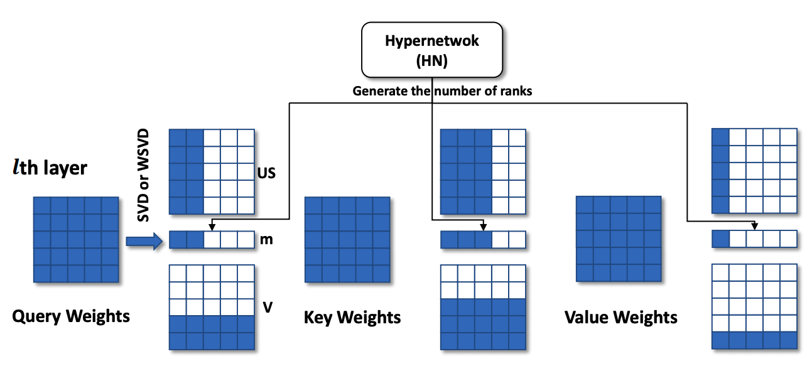

# Adaptive Rank Selection for Low-Rank Approximation of Language Models
This repository contains the implementation (unofficial) of the paper "Adaptive Rank Selections for Low-Rank Approximation of Language Models". The method introduces learnable neural networks to predict optimal decomposition ranks. This repo only implements the rank selection step - i.e it only implements [Algorithm 1: Adaptive Rank Selection](https://aclanthology.org/2024.naacl-long.13.pdf). Fine-tuning after rank selection is not implemented

<p align="center">

  <p style="font-size: 14px; color: gray;">
    <a href="https://aclanthology.org/2024.naacl-long.13.pdf">Figure 1</a>
  </p>
</p>

## Implementation Caveats:
* Implementation of SVD: ASVD and Fisher SVD is implemented, doesn't implement IWSVD. IWSVD is utilized in final paper.

## Setup
* `conda create --name svd python=3.9; conda activate svd`
* `pip install -r requirements.txt`
	* install may fail of [eval harness](https://github.com/EleutherAI/lm-evaluation-harness). In that case, install from source as mentioned in their README

## Training 

```
# constants
NUM_TRAIN_SAMPLES=50000
MAX_LEN=256
BETA=1.
ACT_AWARE=activation
COMP_VALUES=(0.90 0.85 0.80)
EVAL_BS=8
BATCH_SIZE=4
LTYPE=adaptive
R_LOSS=default
LR=1e-3

MODEL=meta-llama/Llama-2-7b-hf
CACHE_DIR=cache_train_llama2
LAMBDA=16.
GAMMA=1.

#MODEL=meta-llama/Meta-Llama-3-8B
#CACHE_DIR=cache_train_llama
#LAMBDA=8.
#GAMMA=2.

#MODEL=google/gemma-7b
#CACHE_DIR=cache_train_gemma
#LAMBDA=8.
#GAMMA=2.

# Loop over the COMP values
for i in ${!COMP_VALUES[@]}; do
    COMP=${COMP_VALUES[$i]}
    EXP_NAME="${MODEL#*/}_${LTYPE}_${COMP}_${GAMMA}_${LAMBDA}"
    p_param=0.4
    # Check if it's the first iteration
    if [ $i -eq 0 ]; then
        # Command for the first iteration without extra arguments
        python train_adaptive.py --model=$MODEL --target_param_ratio=$COMP --eval_full --batch_size=$BATCH_SIZE --lr=$LR --num_train_samples=$NUM_TRAIN_SAMPLES --exp_name=$EXP_NAME --max_length=$MAX_LEN --cache_dir=$CACHE_DIR --eval_freq_steps=500 --eval_batch_size=$EVAL_BS --alpha=0.5 --lambda=$LAMBDA --gamma=$GAMMA --act_aware=$ACT_AWARE  --layer_type=$LTYPE --beta_scale=$BETA --r_loss=$R_LOSS --tau=0.4 --p_param=$p_param
    else
        python train_adaptive.py --model=$MODEL --target_param_ratio=$COMP --eval_full --batch_size=$BATCH_SIZE --lr=$LR --num_train_samples=$NUM_TRAIN_SAMPLES --exp_name=$EXP_NAME --max_length=$MAX_LEN --cache_dir=$CACHE_DIR --eval_freq_steps=500 --eval_batch_size=$EVAL_BS --alpha=0.5 --lambda=$LAMBDA --gamma=$GAMMA --act_aware=$ACT_AWARE --layer_type=$LTYPE --beta_scale=$BETA --r_loss=$R_LOSS --tau=0.4 --p_param=$p_param --load_act_cache
    fi
done
```
